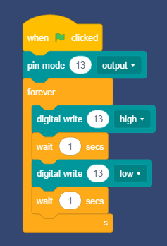

## Basic LED blink example.

Connect LED module to pin 13, or use led on board (the blink led).

Drag the code block as below.



And push the "GREEN FLAG" button to execute the code, you may see the led is blinking.

---
#### Arduino C++
Press "*Translate*" button in the arduino panel and translate the graph code into C++ code.

```cpp
#include <Arduino.h>


void setup(){
	pinMode(13,OUTPUT);

}

void loop(){
	digitalWrite(13,HIGH);
	delay(1*1000);
	digitalWrite(13,LOW);
	delay(1*1000);

}

```

Then press "*Upload*" button, the Arduino IDE will compile the C++ code and upload to Arduino UNO board in the background. After successful uploading, you may find that led 13 is blinking.