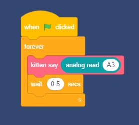

### Read a voltage level from a potentialmeter.

Connect the potentialmeter module to main board as below.


Drag modules into kittenblock.



Connect the mainboard by selecting the right port in the uart port drop-down.

Hit the "GREEN FLAG" button and the Kitten sprite in the main panel may speak the value on the potentialmeter loud and clear.


---
### The C++ code

Since the kitten say block can't be translate into Arduino C++ code. You have to replace it by Serial print module as below.


press "Translate" button and you may get the translated C++ code:

```cpp

#include <Arduino.h>

void setup(){

}

void loop(){

    Serial.println(analogRead(A3));
    delay(0.1*1000);

}

```

upload the code up to mainboard and connect the uart port, the potentialmeter value is echo in the console.


